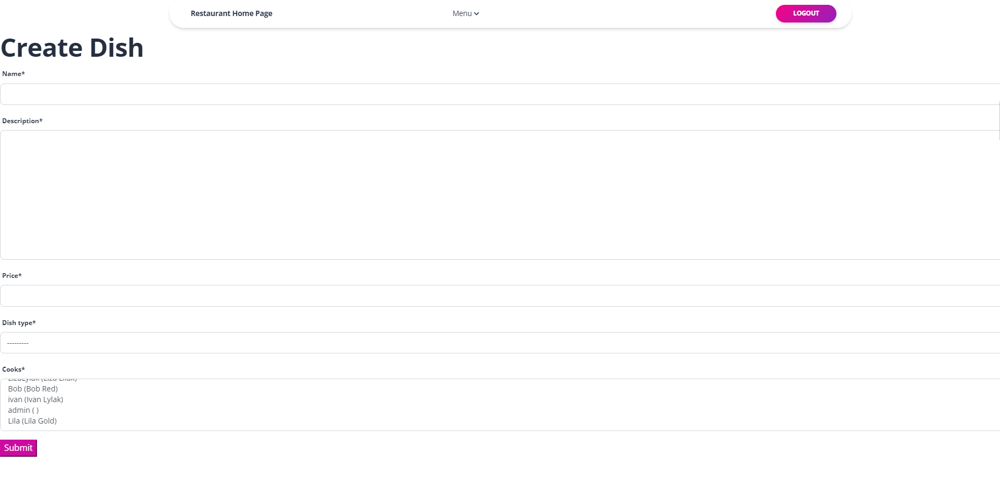
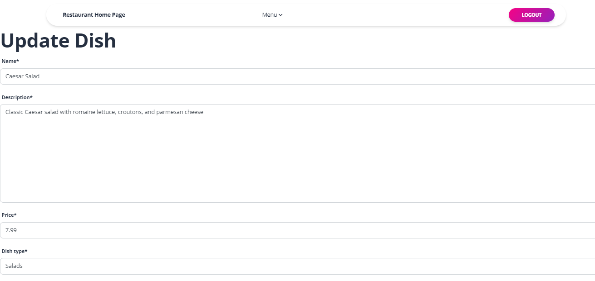
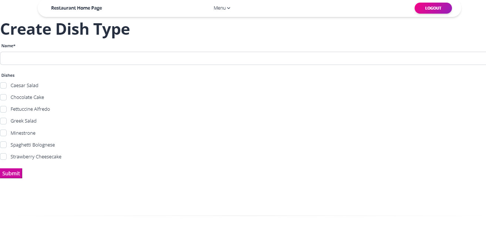
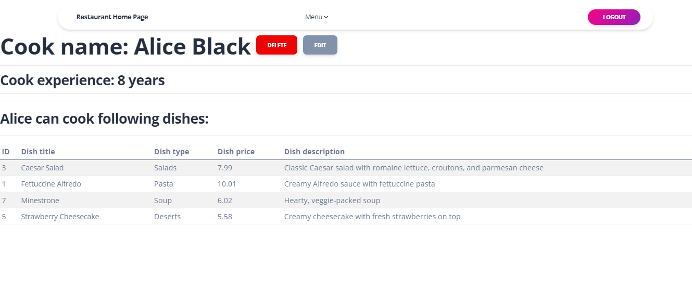
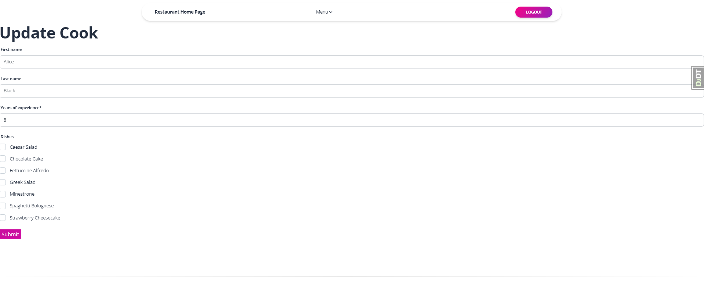
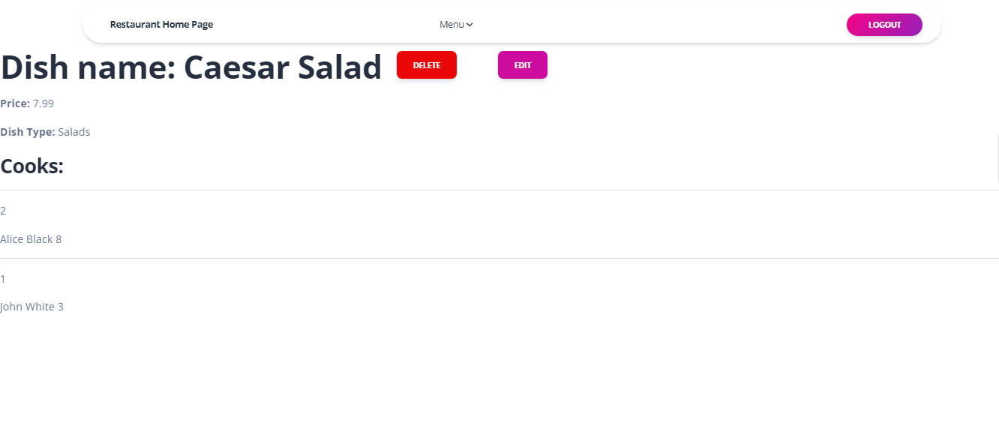
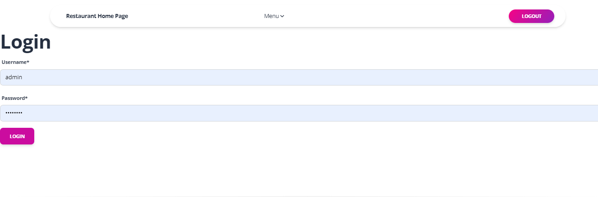

# 📌 Features

#### 🍽 DishType Management

* Seamlessly organize your menu by categorizing dishes into different types.
* Add, modify, and remove dish types to keep your menu well-structured.

#### 🥘 Dish Management

* Easily create and update dishes with key details like name, description, and price.
* Link each dish to a specific category for better menu organization.
* Remove outdated or discontinued dishes in just a few clicks.

#### 👨‍🍳 Cook Management

* Maintain a structured list of kitchen staff with the Cook database.
* Assign cooks to specific dishes or categories for efficient kitchen workflow.
* Update cook details or remove inactive staff as needed.

#### 🚀 Streamline your kitchen operations with an intuitive management system!

## 🗂 The structure of the database:

#### Django project for restaurant kitchen service


## Installation
#### Pyhton3 should be already installed
```bash 
https://github.com/AchillesPython/restaurant-kitchen.git
```
```bash
cd restaurant-kitchen
```
```bash 
python3 -m venv venv
```
```bash 
source venv/Script/activate
```
```bash 
pip install -r requirements.txt
```
```bash 
python manage.py runserver
```

## ⚙️ Loading Initial Data (Optional)


#### To load initial sample data into your database, you can use the following command:

```bash 
python manage.py loaddata kitchen_db_data.json
```

## DEMO







